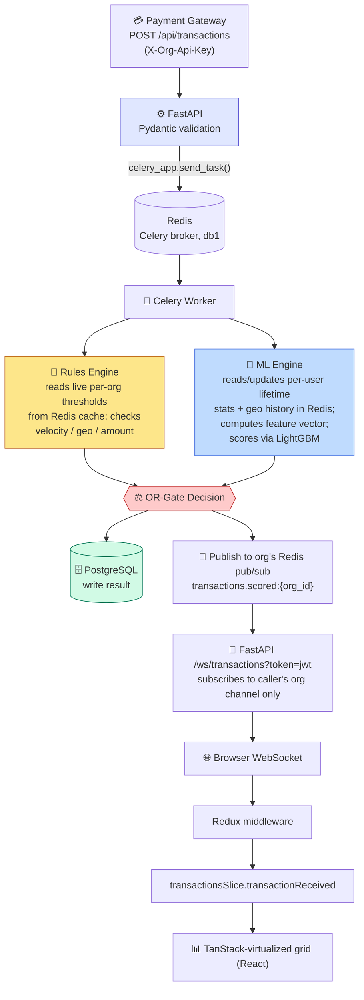
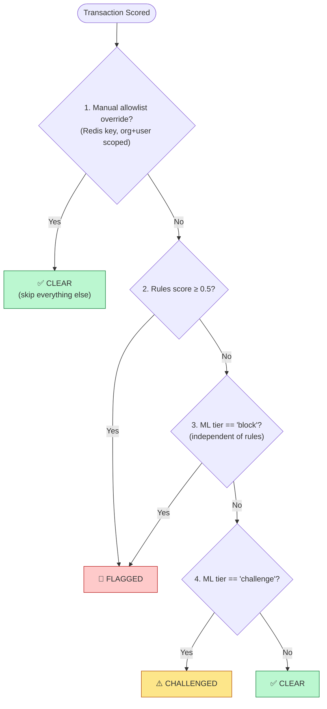
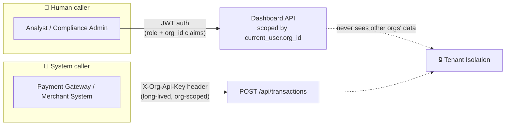
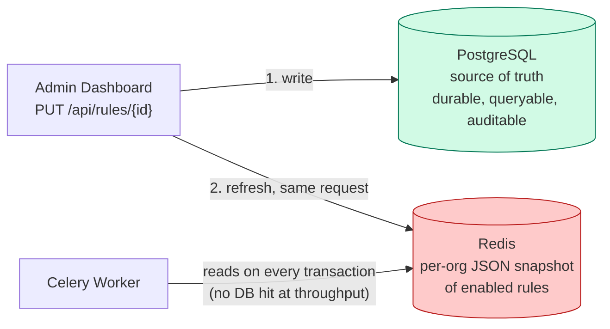
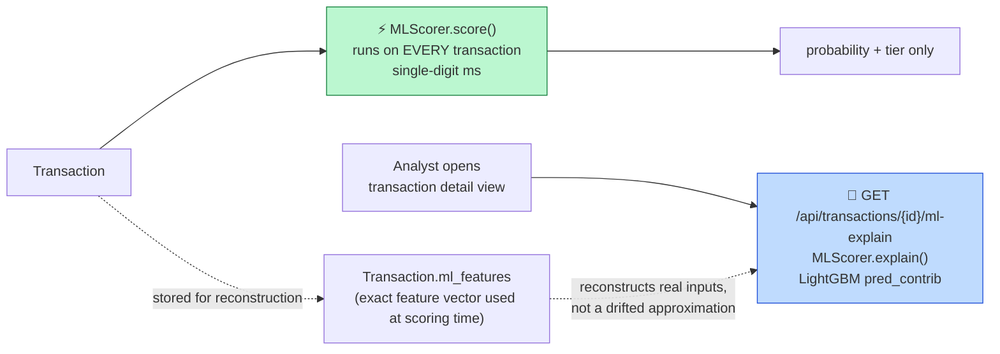

# 🏛️ Architecture

This document covers how a transaction actually moves through Sentinel, why the decision engine is built as an OR-gate instead of a blended score, and the multi-tenancy, caching, and explainability decisions behind it.

---

## 📦 Transaction Lifecycle

> **Key design point:** the API never touches scoring logic or the database in the request path — it only validates and hands off. That's what keeps `POST /api/transactions` fast enough to sustain high throughput without falling behind.

---

## ⚖️ The OR-Gate Decision Engine

Two scoring engines run on **every** transaction, **independently** — this is deliberately not a linear blend of the two scores.

Why not blend the two scores into one? A weighted average risks diluting a real, high-confidence ML signal into irrelevance whenever the rules engine disagrees. Keeping the engines OR-gated means either one can independently stop a transaction. Full reasoning — and how the `challenge`/`block` thresholds are actually derived from validation data, not guessed — lives in [`ML_DESIGN.md`](ML_DESIGN.md).

---

## 🏢 Multi-Tenancy

Every `User`, `Transaction`, `FraudRule`, and `AllowlistEntry` belongs to exactly one `Organization`. Two different authentication mechanisms exist for two different kinds of caller:

| Caller | Auth Mechanism | Scope |
|---|---|---|
| **Analyst** (dashboard user) | JWT — carries `role` and `org_id` claims | Every API query is scoped by `current_user.org_id`; one tenant's analyst can never see another tenant's transactions, rules, or reviews |
| **Payment gateway / merchant system** (ingestion) | Org API key (`X-Org-Api-Key` header) | Long-lived, org-scoped credential — not a human, so not a JWT |

The **live WebSocket feed** is scoped the same way: each org has its own Redis pub/sub channel (`transactions.scored:{org_id}`), and the JWT passed as a WebSocket query param determines which channel a given connection subscribes to.

The Redis rules cache, velocity-tracking sorted sets, per-user lifetime stats, and allowlist entries are all keyed by org as well — see `app/redis_client.py` for the exact key scheme.

---

## 🗄️ Why Postgres *and* Redis for Rules

Postgres is the source of truth for `fraud_rules`. Redis holds a per-org JSON snapshot of the *enabled* rules that Celery workers read on every transaction, because hitting Postgres per transaction at throughput would be wasteful. Every write from the admin dashboard writes to Postgres **and** refreshes the Redis snapshot in the same request — so the very next transaction scored uses the new threshold, **with no deploy and no restart**.

---

## 🧠 The ML Layer's Redis State

Separate from the rules engine's sliding-window sorted set (`velocity:org:{org_id}:user:{user_ref}`), two more per-user Redis structures feed the ML feature computation:

| Redis Key | Type | Feeds |
|---|---|---|
| `stats:org:{org_id}:user:{user_ref}` | hash | Lifetime transaction count, sum, sum-of-squares (running mean/std → `amount_z_score`), last transaction timestamp |
| `geo:org:{org_id}:user:{user_ref}` | hash | Lifetime count per country → `geo_country_rarity` |

Both are **read before being updated** in `_fetch_and_update_lifetime_state` — the same fetch-then-update order the offline training replay assumes, which is what keeps train/serve skew at zero. Full reasoning in [`ML_DESIGN.md`](ML_DESIGN.md).

---

## 🔎 Explainability: Fast Path vs. Slow Path

`MLScorer.score()` runs on every transaction and only returns a probability + tier — kept fast. Full per-feature explanation (`MLScorer.explain()`, LightGBM's native `pred_contrib`) is **never** computed during scoring; it's exposed only via `GET /api/transactions/{id}/ml-explain`, called on demand when an analyst opens a transaction's detail view. The exact feature vector used at scoring time is stored on the row (`Transaction.ml_features`) specifically so this reconstructs real inputs, not a drifted approximation from current state.

---

## 🔐 Auth Model

| Role | Permissions |
|---|---|
| `analyst` | View live feed, reports, rules, review transactions, use the allowlist |
| `compliance_admin` | Everything `analyst` can do, plus create/update/delete rules |

Login is rate-limited — **5 failed attempts locks an email for 15 minutes**, tracked in Redis.

---

## 🚧 What's Deliberately Out of Scope for v1

These are natural "here's what I'd do next" talking points, not gaps to hide:

- **Model versioning** via MLflow, automated drift detection, scheduled retraining, and shadow deployment (real practices, discussed in [`ML_DESIGN.md`](ML_DESIGN.md), not built)
- **Historical analytics** beyond the client-side session buffer — Reports aggregates the last 5,000 buffered transactions, not the full historical table
- **Org self-service signup/management UI** — organizations are created via the seed script or directly in the database
- **Horizontal Celery worker autoscaling**

---

*See also: [`ML_DESIGN.md`](ML_DESIGN.md) for the model training methodology and decision-threshold rationale, and [`README.md`](../README.md) for the project overview and quick start.*

